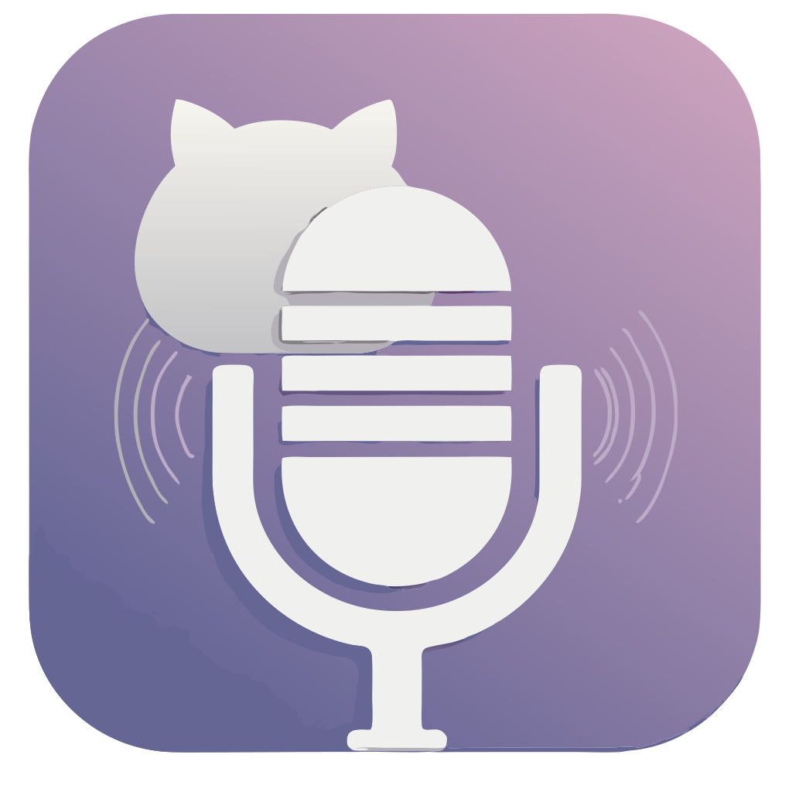

# WhisperCat
<p align="center">
  
</p>

<p align="center">
  
  <a href="LICENSE" target="https://opensource.org/license/mit">
    
  </a>
  
  
  
</p>

WhisperCat is your personal companion for capturing audio, transcribing it, and managing it in one seamless interface. Whether you're taking notes, working on voice memos, or transcribing conversations, WhisperCat makes it simple and efficient. Maximize your productivity with adjustable hotkeys, background operation, and full control over your settings.

---

## Features

- **Record Audio**: Capture sound using your chosen microphone.
- **Automated Transcription**: Process and transcribe your recordings with OpenAI Whisper API.
- **Global Hotkey Support**:
    - Start/stop recording using a global hotkey combination (e.g., `CTRL + R`).
    - Alternatively, use a hotkey sequence (e.g., triple `ALT`) to start/stop recording.
- **Background Mode**: Minimize the application to the system tray, allowing it to run in the background.
- **Microphone Test Functionality**: Ensure you've selected the correct microphone before recording.
- **Notifications**: Receive notifications for important application events, such as recording start/stop or errors.
- **GUI for Settings Management**:
    - Enter your API key for Whisper transcription.
    - Choose and test a microphone.
    - Customize application preferences, including hotkeys and notifications.

---

## Screenshot

Here's what WhisperCat looks like in action:

<p align="center">
  <a href="https://github.com/ddxy/whispercat/blob/master/screenshot.png?raw=true" target="_blank">
    
  </a>
</p>
---

## Installation

1. Visit the **[Releases Page](https://github.com/ddxy/whispercat/releases)** for the WhisperCat project.
2. Download the latest version (`v1.0.0`) for your operating system and follow the setup instructions.

---

## Future Ideas

Here are some planned ideas and features for future releases:

- **macOS Support**: While full macOS support is planned, an **experimental version** is already available. Check it out here: [Experimental macOS Build](https://github.com/ddxy/whispercat/actions/etc). Feedback is welcome!
- **Microphone Selection Improvements**: Revamp the microphone selection process to make it more user-friendly and intuitive.
- **Icon Fixes**: Refine and improve icons and UI graphics for better display on all platforms.
- **Audio Format Options**: Allow users to choose the output audio format (e.g., WAV, MP3).
- **Multiple Language Support**: Expand GUI and transcription support to more languages.
- **Custom Shortcuts**: Add the ability to configure custom hotkeys for various actions.
- **Audio Playback**: Integrate audio playback functionality for recorded files directly within the application.
- **Continuous Recording Mode**: Enable a mode for long-term recording sessions with automatic splitting of large files.
- **Much more**: Maybe another way to package the application

Feel free to contribute any of these features or suggest new ones in the issues section!

---

## Development

For developers who want to contribute to WhisperCat, follow these steps:

1. **Clone the Repository:**
    ```sh  
    git clone https://github.com/ddxy/whispercat.git   
    ```  
2. **Build the Project with Maven:**
    ```sh  
    mvn clean package  
    ```  

---

## Usage

1. **Start the Application:**
    ```sh
    mvn exec:java -Dexec.mainClass="org.whispercat.AudioRecorderUI"  
    ```  
2. **Configure the Application:**
    - Open the settings dialog via the menu.
    - Enter your API key for Whisper transcription.
    - Select and test the desired microphone.
    - Customize other settings, such as hotkeys and notifications.
3. **Start Recording:**
    - Use the configured global hotkey or hotkey sequence to begin recording.

---

## Known Issues

- **Microphone Selection**: Due to Java's audio implementation, more audio devices may be listed than are actually available.  
  Use the "Test Microphone" feature to identify and verify the correct device.

---

## License

This project is licensed under the **MIT License**.

---

## Acknowledgements

- **[OpenAI Whisper API](https://openai.com/whisper)** for providing a powerful transcription engine.
- **[SVG Repo](https://www.svgrepo.com/collection/news/)** for vector graphic resources, including the project icon.

---

## Contributing

Contributions to WhisperCat are welcome! 🎉

- Open an issue to report bugs or suggest new features.
- Submit a pull request to contribute fixes or new functionality.

---

## Contact

For questions, feedback, or support, open an **issue** on the [GitHub repository](https://github.com/ddxy/whispercat).  